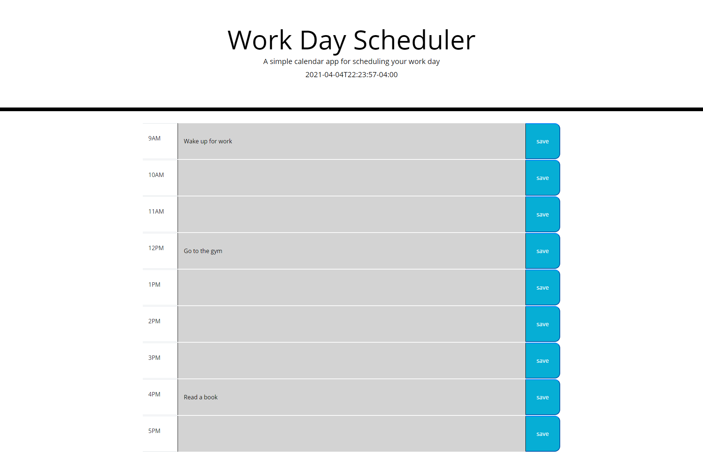

# Work-Day-Schedule

## Acceptance Criteria
```
1. When you open the planner,then yhe current day is displayed at the top of the calendar

2.When you scroll down, then you are presented with timeblocks for standard business hours

3. When you view the timeblocks for that day, then each timeblock is color coded to indicate whether it is in the past, present , or future

4. When you click into the timeblock, then you can enter an event

5. When you click the save button for that timeblock, then the text for that event is saved into local storage

6. When you refresh the page, the save events persist
```

## Mock Model of Website


## Website Link
https://dextervorbe.github.io/Work-Day-Schedule/